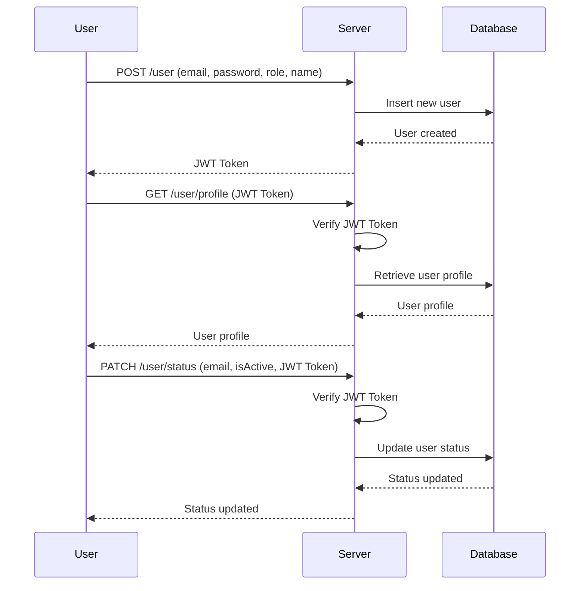

este [ficheiro em português](README.pt.md)

# Node.js API with JWT Authentication

## Introduction

This project is a Node.js API that uses JWT (JSON Web Tokens) for authentication and authorization. The API allows users to register, log in, and access protected routes based on their roles. The implementation includes database connection management, user authentication, and role-based authorization.

## Project Structure
```text
├── app.js 
├── auth.js 
├── db.js 
├── route.js 
├── .env 
└── README.md
```

### File Descriptions

- **app.js**: The main entry point of the application. It sets up the Express server, connects to the database, and mounts the routes.
- **auth.js**: Contains functions for issuing and verifying JWT tokens, as well as middleware for role-based authorization.
- **db.js**: Manages the connection to the MongoDB database.
- **route.js**: Defines the API routes for user registration, login, and profile management.
- **.env**: Contains environment variables for configuration.

### JWT Introduction

JWT (JSON Web Tokens) is a compact, URL-safe means of representing claims to be transferred between two parties. The claims in a JWT are encoded as a JSON object that is used as the payload of a JSON Web Signature (JWS) structure or as the plaintext of a JSON Web Encryption (JWE) structure, enabling the claims to be digitally signed or integrity protected with a Message Authentication Code (MAC) and/or encrypted.

### How It Works

1. **User Registration**: Users can register by providing their email, password, role, and name. The password is hashed before being stored in the database.
2. **User Login**: Users can log in by providing their email and password. If the credentials are correct, a JWT token is issued.
3. **Protected Routes**: Routes are protected using middleware that verifies the JWT token and checks the user's role.

### Routes

#### POST /user

- **Description**: Registers a new user and issues a token.
- **Request Body**:
  - `email`: User's email.
  - `password`: User's password.
  - `role`: User's role (e.g., Admin, User).
  - `name`: User's name.
- **Conditions**: Can be invoked by anyone.

#### GET /user/profile

- **Description**: Retrieves the profile of the authenticated user.
- **Conditions**: Requires a valid JWT token. All roles are allowed.

#### PATCH /user/status

- **Description**: Updates the `isActive` status of a user.
- **Request Body**:
  - `email`: User's email.
  - `isActive`: New status (true or false).
- **Conditions**: Requires a valid JWT token. Only Admin role is allowed.

### Interaction Diagram



### Environment Variables
- DB_URI: MongoDB connection URI.
- DB_NAME: Name of the MongoDB database.
- SECRET_TOKEN: Secret key for signing JWT
- TOKEN_EXPIRY: Expiry time for JWT tokens.
- PORT: Port number for the server.

## Setup
- Clone the repository.
- Create a .env file with the necessary environment variables.
- Install dependencies: npm install.
- Start the server: node app.js.

## Conclusion
This project demonstrates a simple implementation of JWT authentication and authorization in a Node.js API. It includes user registration, login, and protected routes based on user roles. The use of JWT ensures secure and stateless authentication, making it suitable for scalable applications.

