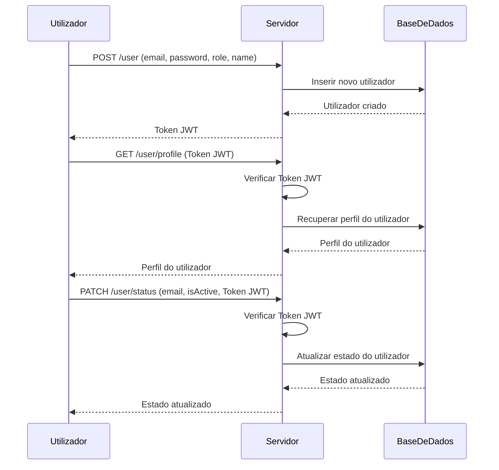

this [file in english](README.md)

# API Node.js com Autenticação JWT

## Introdução

Este projeto é uma API Node.js que utiliza JWT (JSON Web Tokens) para autenticação e autorização. A API permite que os utilizadores se registem, façam login e acedam a rotas protegidas com base nos seus papéis. A implementação inclui gestão de conexão à base de dados, autenticação de utilizadores e autorização baseada em papéis.

## Estrutura do Projeto
```text
├── app.js 
├── auth.js 
├── db.js 
├── route.js 
├── .env 
└── README.md
```


### Descrição dos Ficheiros

- **app.js**: O ponto de entrada principal da aplicação. Configura o servidor Express, conecta-se à base de dados e monta as rotas.
- **auth.js**: Contém funções para emitir e verificar tokens JWT, bem como middleware para autorização baseada em papéis.
- **db.js**: Gere a conexão à base de dados MongoDB.
- **route.js**: Define as rotas da API para registo de utilizadores, login e gestão de perfis.
- **.env**: Contém variáveis de ambiente para configuração.

### Introdução ao JWT

JWT (JSON Web Tokens) é um meio compacto e seguro de representar reivindicações a serem transferidas entre duas partes. As reivindicações em um JWT são codificadas como um objeto JSON que é usado como o payload de uma estrutura JSON Web Signature (JWS) ou como o texto simples de uma estrutura JSON Web Encryption (JWE), permitindo que as reivindicações sejam assinadas digitalmente ou protegidas com integridade com um Código de Autenticação de Mensagem (MAC) e/ou criptografadas.

### Como Funciona

1. **Registo de Utilizador**: Os utilizadores podem registar-se fornecendo o seu email, password, papel e nome. A password é hashada antes de ser armazenada na base de dados.
2. **Login de Utilizador**: Os utilizadores podem fazer login fornecendo o seu email e password. Se as credenciais estiverem corretas, um token JWT é emitido.
3. **Rotas Protegidas**: As rotas são protegidas usando middleware que verifica o token JWT e verifica o papel do utilizador.

### Rotas

#### POST /user

- **Descrição**: Regista um novo utilizador e emite um token.
- **Corpo da Requisição**:
  - `email`: Email do utilizador.
  - `password`: Password do utilizador.
  - `role`: Papel do utilizador (e.g., Admin, User).
  - `name`: Nome do utilizador.
- **Condições**: Pode ser invocada por qualquer pessoa.

#### GET /user/profile

- **Descrição**: Recupera o perfil do utilizador autenticado.
- **Condições**: Requer um token JWT válido. Todos os papéis são permitidos.

#### PATCH /user/status

- **Descrição**: Atualiza o campo `isActive` de um utilizador.
- **Corpo da Requisição**:
  - `email`: Email do utilizador.
  - `isActive`: Novo estado (true ou false).
- **Condições**: Requer um token JWT válido. Apenas o papel Admin é permitido.

### Diagrama de Interação


### Variáveis de Ambiente

- DB_URI: URI de conexão ao MongoDB.
- DB_NAME: Nome da base de dados MongoDB.
- SECRET_TOKEN: Chave secreta para assinar tokens JWT.
- TOKEN_EXPIRY: Tempo de expiração dos tokens JWT.
- PORT: Número da porta para o servidor.

### Configuração
1. Clone o repositório.
1. Crie um ficheiro .env com as variáveis de ambiente necessárias.
1. Instale as dependências: npm install.
1. Inicie o servidor: node app.js.


## Conclusão
Este projeto demonstra uma implementação simples de autenticação e autorização JWT numa API Node.js. Inclui registo de utilizadores, login e rotas protegidas com base nos papéis dos utilizadores. O uso de JWT garante uma autenticação segura e sem estado, tornando-o adequado para aplicações escaláveis.

